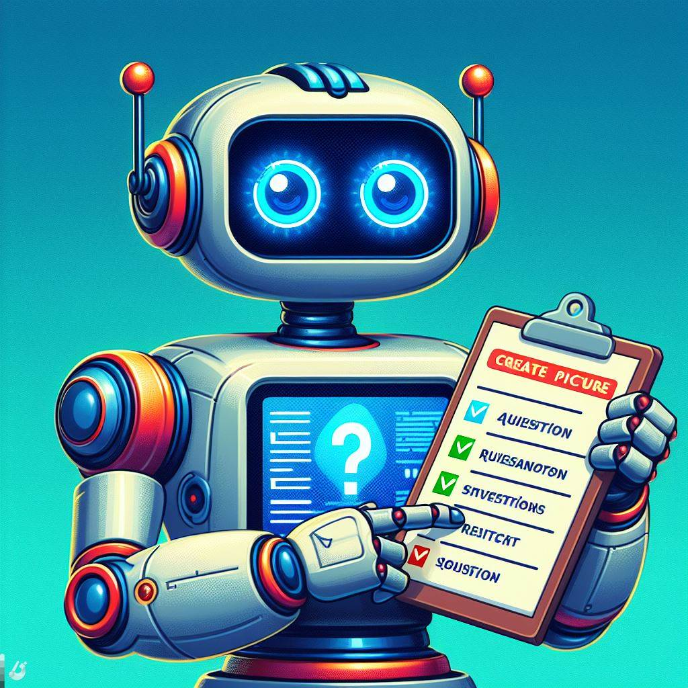

# Chatbot for AI Questions

This is a simple chatbot designed to answer questions related to artificial intelligence (AI). 
The chatbot uses an SQLite database to store predefined questions and answers. The code is written in Python.

___
### Prerequisites

Make sure you have the following installed on your system:

- Python
- SQLite


## Setup
You don't need to set up anything. All is ready to work!
## Usage
1. Run the Chatbot:
Execute the main script [chatbot_sqllite.py] to start the chatbot.

2. Ask Questions:
Enter your AI-related questions when prompted.

3. Exit:
Type 'exit' to end the conversation and close the chatbot.

___

### Example of Interaction
```
Your question: What is the difference between classification and regression in machine learning?
¨¨¨¨¨¨¨¨¨¨¨
Chatbot:
Classification involves predicting a category or label, while regression predicts a continuous
quantity. For example, classifying emails as spam (classification) or predicting house prices
(regression).
¨¨¨¨¨¨¨¨¨¨¨¨¨¨¨¨¨¨¨¨¨¨¨¨¨¨¨¨¨¨¨¨¨¨¨¨¨
(Enter 'exit' to end the conversation)
Your question: exit
Goodbye!
```

___
### Additional Notes

- The chatbot formats the answers for better readability by limiting each line to a certain character limit.
- Common words are used as keywords to match questions with the predefined database entries.

